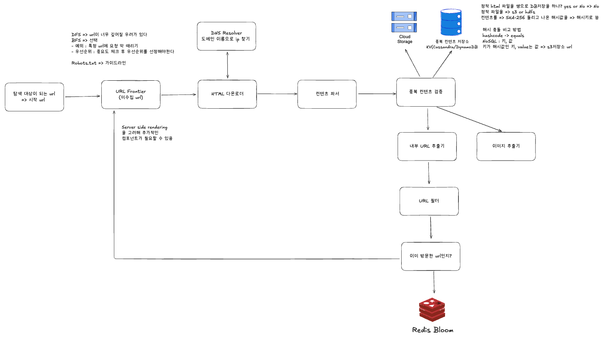
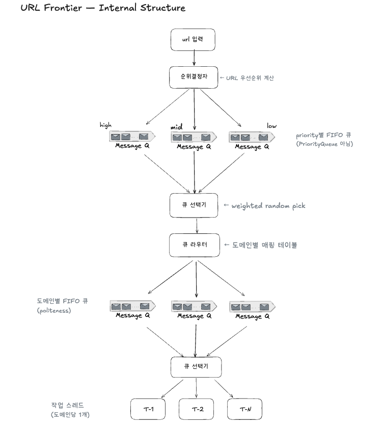
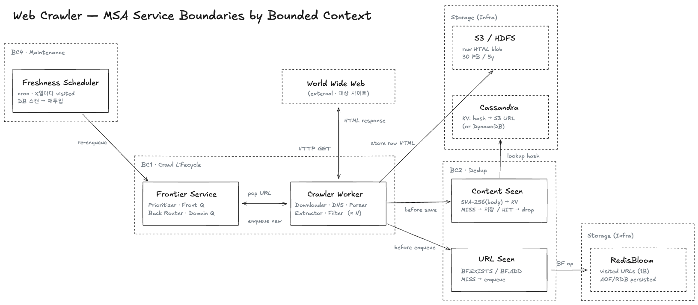

# Web Crawler — Software Design Document

> **이 템플릿은 무엇인가**
> 엔지니어링 팀이 실무에서 쓰는 정통 Software Design Document(SDD) 골격. IEEE 1016-2009 학술 구조 + Atlassian 실무 가이드 + CMS 엔터프라이즈 항목 + Notion 모던 메타데이터를 통합한 형태. 모의 인터뷰 스타일이 "사고 흐름 기록"이라면, 이 문서는 **결정의 근거와 추적 가능성**을 남기는 "팀 자산"이다.
>
> **사용법**
> 1. 이 파일을 `<topic>/System-Design-Document/sdd.md`로 복사
> 2. 중괄호(`{...}`)와 안내문(`> _Note:_ ...`)을 자기 답으로 대체
> 3. 작성 순서 권장: Metadata → Introduction → Goals/Non-Goals → Constraints → Architecture → Data → Component → Interface → NFR → Cross-cutting → Decisions → Alternatives → Risk → Traceability → Testing → Rollout → Glossary
> 4. 너무 격식이 부담되면 Risk Register / Traceability / Appendix는 생략 가능 (※ "선택" 표시 섹션)

---

## 0. Document Metadata

> _Why_
> 변경 이력과 책임자를 명시해 문서를 "팀 자산"으로 만든다. 메타데이터가 없는 SDD는 시간이 지나면 신뢰도를 잃는다.

| 항목 | 값 |
|---|---|
| Document Title | Web Crawler SDD |
| Version | 0.1 (Draft) |
| Status | Draft |
| Author(s) | {이름} |
| Reviewer(s) | {이름} |
| Last Updated | YYYY-MM-DD |
| Related Documents | `mock-interview.md`, `study-notes/meeting-transcript.md`, `study-notes/meeting-summary.md`, Alex Xu Vol.1 Ch.9 |

### 0.1 Revision History

| Version | Date | Author | Change |
|---|---|---|---|
| 0.1 | YYYY-MM-DD | {이름} | Initial draft from mock-interview.md + 회의록 migration |

---

## 1. Introduction

> _Why_
> 독자가 본문을 읽기 전에 "이 문서가 무엇이고 왜 존재하는지"를 30초 안에 파악하게 한다. PRD가 "무엇을 만들 것인가"라면 SDD는 "어떻게 만들 것인가"의 시작점.

### 1.1 Purpose
> _What goes here_
> 이 SDD가 다루는 시스템 / 모듈, 작성 목적, 대상 독자 (예: backend 팀, SRE, 보안 검토자).

이 문서는 **검색엔진 인덱싱용 웹 크롤러 시스템**의 설계를 기술한다. 매월 1B (10억) 페이지를 다운로드하여 검색엔진에 공급하는 분산 배치 크롤러를 대상으로 한다. 대상 독자는 {이름 — backend 팀, SRE 등}.

### 1.2 Scope
> _What goes here_
> 문서가 커버하는 범위. "이 SDD는 X를 다루며, Y는 별도 문서에서 다룬다."

- **In scope**:
  - URL Frontier (미수집 URL 큐 — 우선순위 + 도메인별 politeness)
  - HTML Downloader, DNS Resolver, Content Parser
  - Content dedup (SHA-256 + S3 + NoSQL KV)
  - URL Extractor + URL Filter
  - URL Seen 검사 (RedisBloom)
  - 신선도 (재방문) batch
  - 확장 모듈 (parser plug-in) 인터페이스
- **Out of scope** (회의에서 후보로만 언급, 미확정):
  - {JavaScript/SSR 동적 렌더링}
  - {인증 필요 페이지 / login wall}
  - {검색 인덱스 구축 자체 — 별도 시스템}
  - {실시간 크롤링}

### 1.3 References
> _What goes here_
> PRD, ADR, 외부 표준, 관련 RFC.

- Alex Xu, *System Design Interview Vol.1*, Chapter 9 — 웹 크롤러 설계
- `web-crawler/System-Design-Document/mock-interview.md` — Mock interview style 설계 문서 (이 SDD의 입력)
- `web-crawler/study-notes/meeting-transcript.md` — 회의 대화 트랜스크립트
- `web-crawler/study-notes/meeting-summary.md` — 회의 정리·요약
- robots.txt 표준 (RFC 9309)
- {ADR-001 ~ ADR-004 — §11 참조}

---

## 2. System Overview

> _Why_
> 본격 설계 진입 전 "시스템이 무엇을 하고 어디에 위치하는지" 2–3문단으로 압축. 다이어그램 1개 권장 (context diagram).

본 시스템은 **분산 웹 크롤러**로, seed URL 묶음에서 출발해 BFS로 웹을 탐색하며 HTML 페이지를 다운로드·저장하는 역할을 수행한다. 외부적으로는 **웹 (대상 사이트들)** 과 상호작용하며 (HTTP GET + DNS 조회), 내부적으로는 URL Frontier · 다운로더 · 파서 · dedup 검사 · URL 추출/필터 등의 컴포넌트로 구성된다. 산출물은 검색엔진의 **인덱싱 파이프라인 (별도 시스템)** 에 공급된다.

```
┌─ External ─────────┐    ┌─ Web Crawler ──┐    ┌─ External ─────────┐
│ World Wide Web     │ →  │  This SDD       │ →  │ Search Index       │
│ (대상 사이트들)     │ ◄─ │                │    │ (별도 시스템)        │
└────────────────────┘    └────────────────┘    └────────────────────┘
```

상세 컴포넌트 흐름은 §5.2 / `mock-interview.md` §2.4 참조.

---

## 3. Goals and Non-Goals

> _Why_
> Atlassian / Notion / Google 디자인 독의 공통 항목. **무엇을 하지 않을지 명시하는 것이 무엇을 할지 명시하는 것만큼 중요하다.**

### 3.1 Goals
> _What goes here_
> 측정 가능한 목표. "빠르게" 같은 형용사 대신 "p99 < 100ms"처럼.

- G-1: 매월 1 B (10억) 페이지 크롤 (평균 ~400 pages/sec, peak ~800 pages/sec)
- G-2: 5년 누적 raw HTML 30 PB 저장 (분산 blob)
- G-3: BFS 트래버설로 seed URL 부터 시작해 신규 + 수정 페이지 모두 발견
- G-4: URL 중복 / 본문 중복 모두 제거 (RedisBloom + SHA-256/KV 두 단계)
- G-5: 새 컨텐츠 형태 추가 시 시스템 재설계 없이 모듈 추가만으로 가능 (parser plug-in)
- G-6: 도메인 단위 politeness 준수 (robots.txt + per-domain rate limit)

### 3.2 Non-Goals
> _What goes here_
> 명시적으로 다루지 않을 것. 스코프 크리프 방지.

> _회의에서 후보로만 언급, 명시적 확정 X — 다음 회차 결정 필요:_
- NG-1 (후보): JavaScript 렌더링 / SSR (정적 HTML만 다룸)
- NG-2 (후보): 인증 필요 페이지 / login wall
- NG-3 (후보): 검색 인덱스 구축 (저장만 하고 indexing은 별도 시스템)
- NG-4 (후보): 실시간 크롤링 (배치 기반)

---

## 4. Constraints

> _Why_
> 설계 자유도를 제한하는 외부 요인. Constraints는 "선택 사항이 아닌 것"이고 Non-Goals는 "선택했지만 안 하는 것" — 혼동 금지.

### 4.1 Technical Constraints
- {예: 회사 표준 스택은 Java 21 / Spring Boot 3 / PostgreSQL 16}
- {예: 레거시 인증 시스템과 SAML 연동 필수}

### 4.2 Organizational / Business Constraints
- {예: 예산 상한 $X / month}
- {예: 팀 규모 backend 2명 + frontend 1명}

### 4.3 Regulatory / Compliance Constraints
- {예: GDPR — EU 사용자 데이터는 EU 리전 보관}
- {예: PCI-DSS — 결제 데이터 직접 저장 금지}

---

## 5. System Architecture

> _Why_
> 시스템의 뼈대. 컴포넌트 분해, 통신 방식, 배포 토폴로지를 한눈에 보이게 한다. 다이어그램 없이는 의미 없음.

### 5.1 Architectural Style

**분산 배치 크롤러** — 다중 워커 노드가 URL Frontier 큐에서 URL을 가져와 병렬 다운로드. 작업 스레드는 도메인별 1개로 제한 (politeness).

- **외부 통신**: HTTP GET (대상 사이트), DNS 조회
- **내부 큐 / 영속 저장**: URL Frontier (in-memory + 영속), RedisBloom (URL Seen 검사), Cassandra/DynamoDB (Content Seen 인덱스), S3/HDFS (raw HTML)
- **워커 런타임**: Spring Boot 다중 인스턴스 가정 (회의에서 명시적 확정은 안 됐으나 프로젝트 표준 stack)

선택 근거:
- 분산 (단일 노드 X) → 1 B/month 처리량과 30 PB 저장 요구사항을 단일 노드가 받을 수 없음
- 배치 (실시간 X) → 신선도 batch는 주기적이고, 즉시성 요구 없음

> _상세 monolith vs MSA 분리 / 배포 단위 / 동기·비동기 통신 프로토콜은 회의 미논의._

### 5.2 Component Diagram

**전체 컴포넌트 플로우** (회의 §2):



> _아래는 같은 다이어그램의 텍스트 버전 (diff 추적용):_

```
[Seed URLs]
     │
     ▼
[URL Frontier (미수집)]   ◄────────────┐
     │                                  │ (재투입)
     ▼                                  │
[HTML Downloader]  ── DNS query ──► [DNS Resolver]
     │                              (캐싱 + 타임아웃 + 지역성)
     ▼
[Content Parser]
     │
     ▼
[Content Seen?]  ─── lookup ───►  ┌─ KV (Cassandra/DynamoDB) ─┐
     │  HIT → 폐기                │ key   = SHA-256(body)      │
     │  MISS                      │ value = S3 URL             │
     ▼                            └────────────┬───────────────┘
[S3 Storage (raw HTML)]  ◄────── store ────────┘
     │
     ▼
[URL Extractor]  ◄── parser plug-in (HTML / PNG / PDF)
     │
     ▼
[URL Filter]   ── 부적절 URL 차단
     │
     ▼
[URL Seen?]  ─── BF.EXISTS ───►  ┌─ RedisBloom ──────────────┐
     │  HIT → 폐기                │ AOF/RDB 영속               │
     └─ BF.ADD + enqueue ───────► │ capacity 1B, FPR 1%        │
              │                   └────────────────────────────┘
              ▼
        URL Frontier 재투입
```

**URL Frontier 내부 구조**:



> _아래는 같은 다이어그램의 텍스트 버전 (diff 추적용):_

```
URL 입력
    ▼
[Prioritizer]                                    ← 우선순위 계산
    ▼
┌──────┬──────┬──────┐
│ Q-H  │ Q-M  │ Q-L  │                           ← priority별 FIFO 큐
└──┬───┴──┬───┴──┬───┘
       ▼
[Front Queue Selector]                           ← weighted random
       ▼
[Back Queue Router]                              ← 도메인별 매핑
       ▼
┌──────┬──────┬──────┐
│ Q-d1 │ Q-d2 │ Q-dN │                           ← 도메인별 FIFO 큐
└──┬───┴──┬───┴──┬───┘
       ▼
[Queue Selector]
       ▼
┌──────┬──────┬──────┐
│ T-1  │ T-2  │ T-N  │                           ← 작업 스레드 (도메인당 1개)
└──────┴──────┴──────┘
```

> _큐는 priority별 / 도메인별 둘 다 **FIFO**. PriorityQueue 아님._ Priority는 "어느 큐에 넣을지" 결정에만 쓰임.

**MSA 서비스 경계** (Bounded Context 단위):



위 컴포넌트들이 deploy 단위로 어떻게 묶이는지 보여주는 그림. 4개 Bounded Context:

| BC | 컴포넌트 | Deploy 단위 |
|---|---|---|
| **BC1 · Crawl Lifecycle** | URL Frontier · Crawler Worker (Downloader/DNS/Parser/Extractor/Filter in-process) | `frontier-service` + `crawler-worker (× N)` |
| **BC2 · Dedup** | Content Seen Checker · URL Seen Checker | thin lib (Worker 내) 또는 별도 service |
| **BC3 · Storage** | S3/HDFS · Cassandra/DynamoDB · RedisBloom | 인프라 (managed) |
| **BC4 · Maintenance** | Freshness Scheduler | 별도 cron daemon |

핵심 결정: Worker 안에 5개 컴포넌트(HTML Downloader · DNS Resolver · Content Parser · URL Extractor · URL Filter)를 **in-process 로 묶음**. 한 페이지 처리 lifecycle 동안 RPC hop 0 — 풀 MSA로 가면 800 pages/sec × 5 hop = 4000 RPC/sec 폭증.

> _서비스 경계 결정의 ADR (Worker 묶기 / Dedup 분리 / Freshness 분리) 은 다음 회차 정리 — ADR-005 자리._

### 5.3 Deployment Topology
- **Runtime**: {Kubernetes, ECS, Lambda, ...}
- **Region**: {us-east-1 single-region with multi-AZ}
- **Network**: {VPC / subnet / security group 개략}

---

## 6. Data Design

> _Why_
> 데이터 모델은 시스템의 척추. 스키마뿐 아니라 **데이터 라이프사이클**(생성 → 보관 → 삭제)까지 포함.

### 6.1 Data Model / ERD
```
{ER 다이어그램 또는 표. 핵심 엔티티, 관계, 카디널리티.}
```

### 6.2 Data Dictionary
| Entity | Field | Type | Constraint | Description |
|---|---|---|---|---|
| User | id | UUID | PK | |
| User | email | VARCHAR(255) | UNIQUE NOT NULL | |
| ... | | | | |

### 6.3 Data Lifecycle
- **Creation**: {언제, 누가, 어떤 트리거로}
- **Retention**: {보관 기간, 정책}
- **Archival**: {cold storage 이전 기준}
- **Deletion**: {hard delete vs soft delete, 주기}

### 6.4 Data Flow

**시나리오 1: 새 URL의 첫 다운로드 (정상 경로)**

```
1. URL "https://news.example.com/article-42" → URL Frontier 큐에서 dequeue
2. HTML Downloader → DNS Resolver 조회 → IP 획득
3. HTTP GET → 본문 받음
4. Content Parser → 텍스트 정리
5. SHA-256(body) = 8f4d... → KV store lookup → MISS
6. S3 업로드: s3://crawler/.../abc123.html
7. KV store: (8f4d..., s3://crawler/.../abc123.html) 추가
8. URL Extractor → 본문에서 <a> 태그 추출
9. 추출된 URL들 → URL Filter → URL Seen 검사 (BF.EXISTS)
   ├─ MISS인 URL → BF.ADD + URL Frontier 큐에 enqueue
   └─ HIT인 URL → 폐기
```

**시나리오 2: 미러 사이트 (본문 중복)**

```
1. URL "https://mirror-site.com/copy-of-article" 처리 (URL Seen → MISS)
2. 다운로드 → 본문이 시나리오 1의 article-42 와 동일
3. SHA-256(body) = 8f4d... → KV store lookup → HIT
4. S3 업로드 스킵, 페이지 폐기 (디스크 비용 절약)
5. URL Seen 에는 BF.ADD 됨 (다음에 같은 URL이 추출돼도 다시 안 가져옴)
```

**시나리오 3: 신선도 batch 트리거**

```
1. 신선도 batch (별도 cron job): visited DB에서 last_crawled <= now - X 인 URL 선별
2. 선별된 URL들 → URL Frontier 큐에 강제 enqueue (URL Seen 검사 우회)
3. 다운로드 → SHA-256 비교
   ├─ KV HIT (본문 그대로) → 저장 안 함, last_crawled 갱신
   └─ KV MISS (본문 변경) → 새 버전 S3에 저장 + KV에 새 hash 추가
```

> _상세 sequence diagram (timing / 동시성 모델) 은 회의 미논의._

---

## 7. Component Design

> _Why_
> 각 모듈을 구현자가 그대로 코드로 옮길 수 있는 수준까지 명세. 추상적이면 가치 없음.

### 7.1 URL Frontier
- **Responsibility**: 미수집 URL을 우선순위와 도메인별 politeness 를 고려해 작업 스레드에 분배
- **Inputs**: 신규 URL (URL Filter 통과한 것), seed URL, 신선도 batch가 강제 enqueue 한 URL
- **Outputs**: 작업 스레드가 dequeue 할 URL
- **Dependencies**: 없음 (독립 컴포넌트, 영속 큐 백엔드 별도)
- **Core Logic**: §5.2 URL Frontier 내부 구조 다이어그램 참조. Prioritizer → priority별 FIFO 큐 → Front selector → Back router → 도메인별 FIFO 큐 → 작업 스레드.

### 7.2 Content Seen Checker
- **Responsibility**: 다운로드한 페이지 본문이 이전에 저장된 적이 있는지 검사 (중복 저장 방지)
- **Inputs**: Content Parser 가 정리한 본문 텍스트
- **Outputs**: HIT (폐기) / MISS (S3 저장 진행)
- **Dependencies**: KV store (Cassandra/DynamoDB), S3
- **Core Logic**:
  ```
  hash = SHA-256(body)
  result = KV.get(hash)
  if result is not None:
      return HIT
  else:
      s3_url = S3.put(body)
      KV.put(hash, s3_url)
      return MISS
  ```

### 7.3 URL Seen Checker
- **Responsibility**: URL이 이미 방문(또는 큐에 이미 들어간) 적이 있는지 검사
- **Inputs**: URL Filter 통과한 정규화된 URL
- **Outputs**: HIT (폐기, 다운로드 안 함) / MISS (Frontier 큐에 enqueue + Bloom filter add)
- **Dependencies**: RedisBloom (BF.EXISTS, BF.ADD)
- **Core Logic**:
  ```
  if RedisBloom.BF.EXISTS("visited", url):
      return HIT
  else:
      RedisBloom.BF.ADD("visited", url)
      Frontier.enqueue(url)
      return MISS
  ```
- **Note**: Bloom filter 특성상 false positive 1% 발생 가능 — 검색엔진 입장에서 감수.

### 7.4 Freshness Batch
- **Responsibility**: 일정 주기 지난 URL 을 강제로 Frontier 큐에 재투입해 본문 변경 감지 가능하게 함
- **Inputs**: visited URL DB (last_crawled 시각)
- **Outputs**: Frontier 큐에 enqueue 된 URL
- **Dependencies**: URL Frontier, visited URL DB
- **Core Logic**: 책 §Ch.9 의 3가지 전략 중 하나 채택 — {변경 이력 기반 / 우선순위 기반 / Last-Modified+ETag 기반} *— NFR-6 결정 후 확정*

### 7.5 URL Extractor (Parser Plug-in)
- **Responsibility**: 본문에서 추출 대상 (link / image / etc) 을 뽑아냄. 인터페이스로 추상화되어 새 컨텐츠 형태 추가 가능.
- **Inputs**: Content Parser 의 출력 (정리된 텍스트 + 메타)
- **Outputs**: 추출된 URL 리스트
- **Dependencies**: 인터페이스 구현체 (HTMLExtractor, PNGExtractor, PDFExtractor, ...)
- **Core Logic**: 표준 인터페이스 (e.g., `URLExtractor.extract(content) -> List<URL>`), 구현체는 컨텐츠 형태별로 분리.

> _DNS Resolver / HTML Downloader / Content Parser / URL Filter 의 상세 Inputs/Outputs/Core Logic 은 회의 미논의 — 다음 회차 보강 필요._

---

## 8. Interface Design

> _Why_
> 컴포넌트의 외부 노출면. 한 번 공개되면 변경 비용이 큼 — SDD 단계에서 신중히.

### 8.1 External APIs

**N/A** — 본 시스템은 사용자 대면 외부 API를 노출하지 않는다. 배치 크롤러로 동작하며, 산출물 (S3 raw HTML + KV dedup 인덱스) 은 검색 인덱싱 시스템 (별도) 이 직접 읽음.

### 8.2 Internal Service Interfaces
{gRPC proto / 내부 REST / 메시지 큐 토픽 + payload}

> _회의 미논의._

### 8.3 UI Flow (해당 시)

**N/A** — UI 없음.

---

## 9. Non-Functional Requirements

> _Why_
> ISO 25010 품질 모델 기반 분류. 인터뷰 스타일과 달리 **각 항목이 검증 가능한 acceptance criteria**를 가져야 한다.

| Category | Requirement | Acceptance Criteria |
|---|---|---|
| Performance | 처리량 | 평균 400 pages/sec, peak 800 pages/sec |
| Performance | Ingress bandwidth (peak) | ~3.2 Gbps (800 pages/sec × 500 KB × 8) |
| Scalability | 병행성 | 다중 노드 병렬 크롤링, hot reshuffle 없이 worker 추가 가능 |
| Scalability | 누적 저장 | 5년에 30 PB raw HTML (S3 / HDFS 분산) |
| Reliability | 안정성 | 악성 입력 / spider trap / 응답 없는 서버 / 거대 페이지 대응 (graceful degradation) |
| Reliability | Politeness | 도메인당 다운로드 thread 1개 + robots.txt 준수 (per-domain rate limit 수치 미확정) |
| Reliability | 본문 dedup | URL 다른데 본문 동일한 페이지는 저장 X (SHA-256 KV) |
| Reliability | URL dedup | 방문한 URL 재크롤 X (RedisBloom, FPR 1% 감수) |
| Maintainability | 새 컨텐츠 형태 추가 | 모듈 추가만으로 가능 (parser plug-in 패턴) |
| Maintainability | Bloom filter 영속 | Redis AOF/RDB 로 디스크 영속, Redis 재시작 시 복구 |
| Freshness | 재방문 주기 | {1주? 1달? 인기도 기반? — NFR-6 미확정} |
| Availability | {가용성} | {회의 미논의} |
| Security | {인증/인가/암호화} | {회의 미논의} |
| Observability | {추적성/메트릭/알람 임계값} | {회의 미논의 — §10.2 참조} |
| Portability | {환경 격리} | {회의 미논의} |

---

## 10. Cross-Cutting Concerns

> _Why_
> 어느 한 컴포넌트의 책임이 아니라 시스템 전체에 걸쳐 있는 관심사. 한 곳에 모아 두지 않으면 누락되기 쉽다.

### 10.1 Security
- 인증 / 인가 모델 (RBAC / ABAC)
- 비밀 관리 (KMS, Vault)
- 입력 검증 / 출력 인코딩
- 전송 암호화 (TLS), 저장 암호화 (at rest)

### 10.2 Observability

회의 §4.2 에서 식별된 모니터링 대상:

| 대상 | 왜 보는가 |
|---|---|
| **블룸 필터 (Redis)** | 메모리 사용량 / saturation 비율 — 누적 시 false positive rate 폭증 위험 (Bloom filter는 unset 불가) |
| **컨텐츠 파싱 에러** | 파싱 에러 발생 빈도 — 처음에 많이 날 것으로 예상, 로그로 잡기 |
| **큐 적체** | 작업 스레드 처리 속도 < 큐 enqueue 속도 시 비정상 신호 |
| **중복 처리 race** | 같은 URL 동시 처리 발생 빈도 — 정합성 문제, 로깅으로 측정 |
| **DB 일반** | 일반적 DB metric (write/read 쓰루풋, latency, 에러율) |

> _구체 metric / RED·USE 분류 / Tracing (OpenTelemetry) / Alert 임계값은 회의 미논의 — 다음 회차 결정._

### 10.3 Resilience
- 재시도 / 지수 백오프 / jitter
- 서킷 브레이커
- Bulkhead / 격리
- Graceful degradation 시나리오

### 10.4 Privacy
- PII 식별 및 분류
- 데이터 최소화 (collection minimization)
- 사용자 권리(GDPR right-to-erasure 등) 처리 흐름

---

## 11. Architecture Decisions (ADR)

> _Why_
> Michael Nygard ADR 형식. **"왜 이렇게 했나"가 코드보다 빠르게 잊힌다.** 결정 1건당 1 ADR.

### ADR-001: 탐색 알고리즘으로 BFS 채택 (DFS 거절)
- **Status**: Accepted (회의 §3.1)
- **Context**: 1 B 페이지/월 규모로 웹을 트래버설해야 함. 알고리즘 선택이 무한 루프 위험과 처리량에 직결.
- **Decision**: **BFS (너비 우선 탐색)** 채택.
- **Consequences**:
  - Positive: 깊이 무한 파고들 위험 회피. 같은 사이트의 여러 페이지를 균등하게 탐색.
  - Negative: BFS 의 두 약점이 따라옴 — (1) 같은 도메인 URL이 한 페이지에서 많이 추출되면 그 도메인 폭발적으로 때림 (politeness 위반), (2) 우선순위 부재. → URL Frontier 내부 구조로 보완 (§5.2).
  - Neutral: 책 §Ch.9 표준 선택과 동일.

### ADR-002: 컨텐츠 저장은 S3(또는 HDFS) + 별도 NoSQL KV 분리
- **Status**: Accepted (회의 §2.1, §3.1)
- **Context**: 5년에 30 PB raw HTML + 1 B+ 의 dedup 인덱스가 필요. RDB 단일 사용은 인덱스 부담 + write 쓰루풋 한계.
- **Decision**: **S3/HDFS** 에 raw HTML 저장 + 별도 **NoSQL KV (Cassandra / DynamoDB)** 에 dedup 인덱스 (`key=SHA-256(body)`, `value=S3 URL`).
- **Consequences**:
  - Positive: 30 PB blob 은 분산 blob 스토리지가 자연스럽게 처리. KV는 단순 hash lookup 에 최적. 두 저장소 독립 확장.
  - Negative: 컴포넌트 두 개 운영 필요. 두 저장소 간 정합성 (S3 업로드 후 KV 등록 — atomic 아님) → 멱등성 / 재시도 정책 필요.
  - Neutral: 책 §Ch.9 권장.

### ADR-003: URL dedup 자료구조로 RedisBloom 채택 (DB hash set 거절)
- **Status**: Accepted (회의 §3.4, §3.5)
- **Context**: 1 B 단위 visited URLs 검사 필요. 매번 다운로드 직전 lookup 발생.
- **Decision**: **RedisBloom (Redis Bloom Filter 모듈)** 채택. capacity 1 B, FPR 1%, AOF/RDB 로 디스크 영속.
- **Consequences**:
  - Positive: 메모리 ~1.25 GB로 1 B URL 처리 가능 (DB hash set이면 ~80 GB+). 영속 옵션으로 Redis 재시작 / 다음 배치 시작 시 복구 가능. Spring Boot 워커는 `BF.ADD` / `BF.EXISTS` 만 호출.
  - Negative: false positive 1% (≈ 10 M URL이 잘못 visited 판정 → 영원히 안 가져옴). Bloom filter 는 unset 불가 → 누적 시 saturation, 주기적 rebuild 필요. 검색엔진 입장에서 1% 손실 감수.
  - Neutral: 영속이라 신선도 체크 batch 가 별도 필요해짐 → ADR-004 가 따라옴.

### ADR-004: URL Frontier 큐 구조는 priority별 분리 + 각 큐 FIFO (PriorityQueue 거절)
- **Status**: Accepted (회의 §3.2)
- **Context**: BFS 의 우선순위 부재 / politeness 위반 두 약점을 해결해야 함. 큐 구조 선택지 — 단일 PriorityQueue vs priority별 분리.
- **Decision**: **priority 별로 큐를 분리 (high/mid/low) + 각 큐는 FIFO**. 큐 선택기가 가중치 기반 random pick 으로 처리. 그 뒤에 도메인별 큐 (back queue) 분리로 politeness 보장.
- **Consequences**:
  - Positive: 큐 내부에서 추가 정렬 비용 X (FIFO front-pop 만). priority 가중치는 큐 선택기에서 단순 random 으로 표현. 도메인별 큐로 한 도메인은 한 스레드만 처리 → politeness 자동 보장.
  - Negative: 큐 인스턴스 수가 priority × 도메인 만큼 늘어남. 매핑 테이블 (domain → back queue) 관리 필요.
  - Neutral: 책 §Ch.9 표준 디자인.

---

## 12. Alternatives Considered

> _Why_
> 채택하지 않은 대안과 그 기각 이유. 6개월 뒤 누군가 "왜 X를 안 썼지?"라고 물을 때 답이 되는 섹션.

| Alternative | Pros | Cons | Why Rejected |
|---|---|---|---|
| **DFS** (탐색 알고리즘) | 메모리 사용 적음 | 깊이 무한 파고들 위험 | ADR-001 — 웹은 깊이가 사실상 무한 |
| **단일 RDB** (컨텐츠 저장) | 운영 간단 | 30 PB blob + 1 B 인덱스를 한 RDB로 못 받음 | ADR-002 — 인덱스 부담 + write 쓰루풋 한계 |
| **DB hash set** (URL dedup) | False positive 0 | 1 B URL × 80 byte ≈ 80 GB+, lookup latency 큼 | ADR-003 — 메모리/시간 비용 압도적 |
| **단일 PriorityQueue** (URL Frontier) | 한 자료구조로 단순 | 큐 enqueue 시 매번 log(n) 정렬 비용. priority 분리한 의미 사라짐 | ADR-004 — priority별 큐 분리가 더 효율적 |
| **Redis Bloom 휘발 (영속 X)** | 메모리만 쓰면 됨, 빠름 | 매 배치마다 1 B URL 재구축 → 비현실적 비용 | ADR-003 — AOF/RDB 영속 채택 |

---

## 13. Risk Register (선택)

> _Why_
> 엔터프라이즈 SDD의 핵심. 각 위험에 등급과 완화 전략을 매핑.

| ID | Risk | Likelihood | Impact | Mitigation | Owner |
|---|---|---|---|---|---|
| R-1 | **Bloom filter saturation** — 5년 누적 visited URL 5 B+ 누적되면 FPR 1% → 30%+ 폭증, 사실상 모든 URL이 visited 로 잘못 판정 | High | High | 주기적 rebuild (예: 분기마다 영속 visited URL DB 에서 새 Bloom filter 재구성) | {Backend} |
| R-2 | **컨텐츠 파싱 에러** — 다양한 HTML / 깨진 마크업 / 거대한 페이지로 파서 실패 빈발 예상 | High | Medium | 파싱 에러 로깅 + 모니터링 (회의 §4.2). graceful skip + 다음 URL로 진행 | {Backend} |
| R-3 | **큐 적체** — 작업 스레드 처리 속도 < 큐 enqueue 속도 시 메모리/디스크 폭주 | Medium | High | 큐 길이 모니터링 + 알람 (회의 §4.2). 워커 노드 동적 추가 정책 | {SRE} |
| R-4 | **같은 URL 동시 처리 race** — 도메인별 큐 분리에도 불구하고 동시 처리 발생 가능 | Low | Medium | 정합성 로깅으로 발생 빈도 측정 후 필요 시 분산락 도입 | {Backend} |
| R-5 | **동적 렌더링 사이트 누락** — React 기반 SSR/CSR 사이트는 정적 HTML 다운로더로는 본문을 못 가져옴 | Medium | Medium | §추가 검토 — 렌더러 (headless browser) 컴포넌트 도입 검토 | {Backend} |
| R-6 | **DNS 병목** — 단일 DNS resolver / OS 캐시만으로 수백만 도메인 처리 시 병목 가능 | Medium | Medium | DNS Resolver 별도 컴포넌트 필요성 보강 (추가 검토) | {SRE} |

---

## 14. Requirements Traceability (선택)

> _Why_
> IEEE 1016 핵심 항목. 요구사항 번호 ↔ 설계 섹션 매핑으로 커버리지를 증명.

| Req ID | Requirement | Design Section | Test Case |
|---|---|---|---|
| FR-1 | {기능 설명} | §7.1, §8.1 | TC-001 |
| NFR-1 | {p99 < 100ms} | §5, §10.2 | LT-005 |

---

## 15. Testing Strategy

> _Why_
> 무엇을 어떤 깊이로 검증할 것인지를 SDD에서 미리 합의. 구현 후 "그게 테스트 가능했나"를 막는다.

- **Unit**: {커버리지 목표, 핵심 모듈 우선순위}
- **Integration**: {DB / 외부 API mocking 정책, contract test}
- **E2E**: {핵심 사용자 플로우 N개}
- **Load / Performance**: {NFR 검증 시나리오 — k6 / Locust 스크립트}
- **Chaos / Failure Injection**: {network partition, pod kill, DB failover 시나리오}
- **Acceptance**: {PRD 수용 기준 → 자동화 매핑}

---

## 16. Rollout / Deployment Plan

> _Why_
> 인터뷰 스타일과 가장 큰 차이점. 시스템은 코드가 아니라 운영되는 동안에만 가치 — 배포 / 마이그레이션 / 롤백을 설계의 일부로.

### 16.1 Phased Rollout
- Phase 1: {dev 환경 검증 — Day 0}
- Phase 2: {internal canary 1% — Day 7}
- Phase 3: {staged rollout 10% → 50% → 100% — Day 14–21}

### 16.2 Feature Flags
| Flag | Default | Removal Criteria |
|---|---|---|
| `new_engine_enabled` | off | {2주간 100% 트래픽에서 안정 후 제거} |

### 16.3 Data Migration
- 마이그레이션 단계: {dual-write → backfill → cutover → cleanup}
- 롤백 가능 시점: {cutover 이전까지}

### 16.4 Rollback Plan
- 트리거: {error rate > 5% / 5min, p99 > 2× baseline}
- 절차: {flag off → traffic shift → 사후 분석}

---

## 17. Glossary

> _Why_
> 도메인 / 약어 통일. 문서 끝이 아니라 처음에 두는 팀도 많음.

| Term | Definition |
|---|---|
| QPS | Queries per second |
| BFS | Breadth-First Search (너비 우선 탐색) |
| DFS | Depth-First Search (깊이 우선 탐색) |
| URL Frontier | 미수집 URL을 보관하는 우선순위 + 도메인별 분리 큐 시스템 |
| Politeness | 동일 도메인에 짧은 시간 동안 많은 요청을 보내지 않는 크롤러의 예의 |
| robots.txt | 사이트가 크롤러에게 접근 허용/금지 영역을 명시하는 표준 파일 (RFC 9309) |
| Bloom filter | 공간 효율적 확률 자료구조. "어떤 원소가 집합에 있을 수 있다 / 확실히 없다" 만 판정 (false positive 0이 아님, false negative 0) |
| RedisBloom | Redis 의 Bloom filter 모듈 (`BF.ADD`, `BF.EXISTS`, `BF.RESERVE`) |
| FPR | False Positive Rate (Bloom filter 의 거짓양성 비율) |
| Content dedup | 본문 단위 중복 제거 (다운로드한 페이지의 hash 비교) |
| URL dedup | URL 단위 중복 제거 (이미 방문한 URL 큐 재진입 방지) |
| Freshness | 신선도 — 크롤된 페이지의 컨텐츠가 얼마나 최신인지 |
| FIFO | First-In-First-Out 큐 |
| AOF / RDB | Redis 영속 옵션 — Append-Only File (write 로그) / RDB snapshot (주기적 dump) |
| {SLO} | Service Level Objective |

---

## 18. Appendix (선택)

- A. 다이어그램 원본 (PlantUML / Excalidraw 소스)
- B. 외부 참조 자료 / 벤치마크
- C. Capacity 추정 상세 계산
- D. 미해결 질문 (Open Questions)

---

## 부록: 작성 체크리스트

- [ ] **Goals**가 측정 가능한 숫자로 적혔는가
- [ ] **Non-Goals**와 **Constraints**를 분리했는가
- [ ] Architecture diagram이 텍스트 기반(diff 가능)인가
- [ ] Data Lifecycle (생성 → 삭제)이 명시되었는가
- [ ] **Component**가 구현자가 코드로 옮길 수준까지 구체적인가
- [ ] **NFR** 각 항목에 acceptance criteria가 있는가
- [ ] Cross-cutting concerns에 **Observability**가 포함되었는가
- [ ] 주요 결정마다 **ADR**이 1건씩 있는가
- [ ] **Alternatives Considered**에 기각 이유가 적혔는가
- [ ] **Rollout Plan**에 롤백 트리거가 있는가
- [ ] Revision History가 갱신되었는가

---

## 참고 자료

- [Bellevue College — SDD RoadTrip Example (IEEE 1016)](https://www.bellevuecollege.edu/wp-content/uploads/sites/135/2019/04/SDD_RoadTrip.pdf)
- [Atlassian — Software Design Document Guide](https://www.atlassian.com/work-management/knowledge-sharing/documentation/software-design-document)
- [CMS — System Design Document Template](https://www.cms.gov/files/document/sddpdf)
- [Notion — Design Document Template](https://www.notion.com/blog/design-document-template)
- [Design Docs at Google — Industrial Empathy](https://www.industrialempathy.com/posts/design-docs-at-google/)
- [Michael Nygard — Documenting Architecture Decisions](https://www.cognitect.com/blog/2011/11/15/documenting-architecture-decisions)
- [IEEE 1016-2009](https://standards.ieee.org/ieee/1016/4502/)
- [ISO/IEC 25010 Quality Model](https://iso25000.com/index.php/en/iso-25000-standards/iso-25010)
